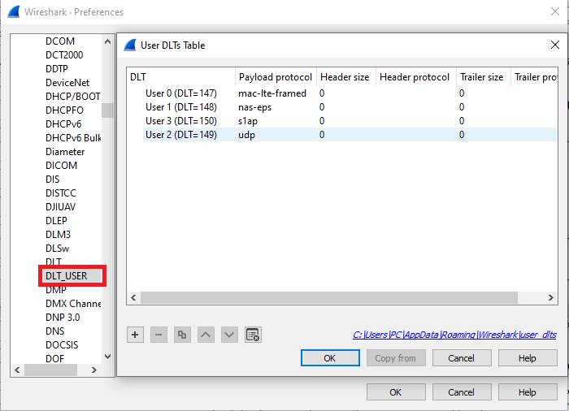
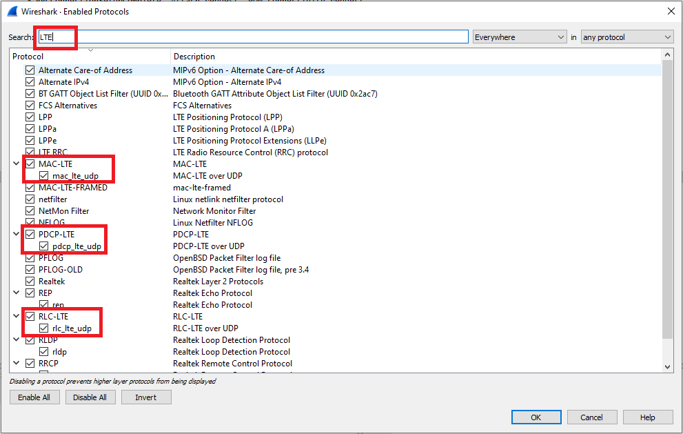

# Pcap Files

Some examples of pcap files that contain decoded traffic between srseNB and a test smartphone.
- ``ltesniffer_dl_mode.pcap``: pcap file from LTESniffer in the downlink sniffing mode (``-m 0``)
- ``ltesniffer_ul_mode.pcap``: pcap file from LTESniffer in the uplink sniffing mode (``-m 1``)
- ``api_collector.pcap``: pcap file from LTESniffer in the API mode (``-m 1 -z 3``)

## WireShark Configuration
Please refer to the following pictures to configure WireShark:
- Go to Edit -> Preferences -> Protocols -> DLT_USER

  

- Go to Analyzer -> Enabled Protocols... -> Search for "LTE"

  

